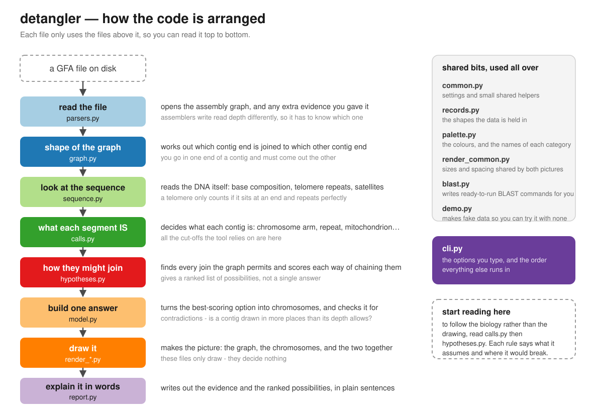

# detangler

Turn a genome assembly graph into a chromosome hypothesis.

detangler reads a GFA assembly graph, classifies every segment, and proposes
ranked hypotheses of how the contigs resolve into linear chromosomes. The graph
alone is enough: length, depth-derived copy number, links, circularity, GC and
telomere motif arrays all come from the GFA. Other evidence is optional and is
used when supplied: read coverage, Flye's `assembly_info.txt`, alignments,
annotation, BLAST hits, and `--assembly-type`, which says what the assembler
produced so depth can be read correctly.

Output is a paired figure with the assembly graph on the left and the inferred
chromosomes on the right, one colour per segment in both panels. No expected
karyotype is needed; the chromosome count comes from the structure of the graph.

## What it looks like

Output on a Flye assembly of *Fusarium graminearum* (ONT, ~22x). Eleven graph
segments on the left; on the right, the molecules they resolve into, smallest to
largest, each with the repeats the graph attaches to its ends. A segment keeps
the same colour in both panels.


This is a demo on a modest assembly, not a benchmark. What the tool infers
depends on how well the graph is resolved to begin with.

## How to run

The simplest run needs only the assembly graph. If the GFA carries sequence,
nothing else is required:

```
python detangler.py --gfa assembly_graph.gfa --out-dir results --prefix myassembly
```

With more evidence (index, segment mapping, read coverage):

```
python detangler.py --fai assembly.fa.fai --gfa assembly.gfa --paf segs_to_assembly.paf \
    --coverage cov.regions.bed.gz --out-dir results --prefix myassembly
```

No data handy? Generate synthetic demo data and run on it:

```
python detangler.py --demo demo_data --out-dir results --prefix demo
```

To override any of the tool's calls, edit the emitted
`results/myassembly_karyotype.yaml` and re-run from it:

```
python detangler.py --config results/myassembly_karyotype.yaml --out-dir results --prefix myassembly
```

## Which GFA to use

This matters more than anything else on this page. Most assemblers write several
graphs, and they are not equally useful here.

**Use the unitig graph, not the contig graph.** For hifiasm that means
`*.r_utg.gfa` (raw unitigs, keeps everything) or `*.p_utg.gfa` (small bubbles
popped), not `*.p_ctg.gfa`. Flye's `assembly_graph.gfa` is already the right
thing.

The reason: a contig graph is the assembler's output *after* it has resolved and
popped everything it could. The tangles have been cleaned away before you see
them. Run on a bird `p_ctg.gfa` here and the file had **34 links for 683
contigs**, so nearly every contig was isolated, there was nothing to join, and
the tool correctly reported 683 pieces and one hypothesis. That is a true
description of the assembly and a useless picture. The unitig graph is where the
ambiguity still lives, and ambiguity is the thing this tool exists to show you.

**The graph must carry sequence.** Verkko's published graphs are named
`*.noseq.gfa` and contain none, which removes GC and telomere arrays, and
telomere-capped ends are how the chromosome count is inferred. If your graph has
no sequence, supply `--fasta` alongside.

## Required inputs

- `--gfa` the GFA v1 assembly graph (the file Bandage opens). If it carries
  sequence, as Flye's does, this is the only input needed.

If the GFA lacks sequence, add one sequence source:

- `--fasta` assembly FASTA (also gives GC and N content), or
- `--fai` samtools faidx index, or
- `--assembly-report` NCBI assembly report

## Optional flags (the useful ones)

- `--flye-info assembly_info.txt` adds Flye graph-path evidence
- `--coverage`, `--annotation`, `--paf`, `--agp` are extra evidence tracks
- `--telomere-motif MOTIF` adds a telomere motif beyond the built-in set
  (vertebrates, land plants, insects, nematodes, ciliates, fungi)
- `--expected-chromosomes N`, `--expected-genome-size N` are cross-checks, never
  required
- `--hypothesis N` draws a specific ranked hypothesis instead of the top one
- `--draw-hypotheses N` draws the top N (max 5) as separate figures, so an
  ambiguous result is not presented as a single answer
- `--assembler flye|hifiasm|verkko|spades|miniasm|canu` says what wrote the GFA.
  This fixes the depth reading, since hifiasm's `rd:i:n` means coverage n+1, and
  is stated in the report. Link overlaps are detected from the file either way
- `--max-graph-nodes N` prunes the drawing to the N longest segments when the
  graph is larger than that, and reports what was dropped. Classification and
  the hypotheses always use every segment; only the picture is partial
- `--graph-style {bandage,layered}` sets the graph panel layout (default bandage)
- `--bandage-image FILE` embeds a real Bandage export as the left panel
- `--blast-db` / `--blast-subject` / `--blast-remote` run BLAST on exported
  candidate segments; fold hits back in with `--blast-hits`
- `--out-dir`, `--prefix`, `--title` control output naming
- `--demo DIR` generates demo data and runs on it

Run `--help` for the full list, including every classification threshold.

## What this is not built for

Large graphs. This is written for tens of segments, not thousands: fungal,
bacterial, organellar, or a plant chromosome set that is already well resolved.

On a synthetic graph with human-like scale (311 segments, 3.0 Gb, not a real
human assembly) the tool finishes in under two minutes and produces a figure,
but neither the figure nor the answer is much use. With no sequence in the GFA
there is no telomere evidence, so nothing caps anything, no joins are asserted,
and every backbone contig becomes its own molecule: 109 of them where there
should be 23. The ten-colour palette also starts repeating, so colour no longer
links the two panels. `--max-graph-nodes` will prune the drawing to keep it
readable, but that does not make the inference any better.

A vertebrate assembly graph wants a different figure, probably one component at
a time. That is not what this draws.

## Checking against a karyotype you already believe

If you know or suspect how many chromosomes there should be, pass
`--expected-chromosomes N`. Every chromosome the graph did not produce then gets
a dashed empty slot labelled *not found*, and a subheading names the number that
was supplied.

```
python detangler.py --gfa assembly_graph.gfa --expected-chromosomes 6 \
    --out-dir results --prefix myassembly
```


Two caveats.

The flag is not a neutral overlay; it changes the answer. Compare the two
figures. Left alone, the tool asserts a join through the AT-rich segment 8 and
reports four chromosomes, with chr 1 built from contigs 2 + 8 + 7. Told to
expect six, it reports five separate molecules, because leaving contigs apart
now scores better than joining them, and segment 8 reverts to a cap on the end
of chr 5. Expecting more chromosomes makes the tool more conservative about
merging. That is the intended behaviour, but it does mean you cannot use the
flag to check a count without also perturbing the inference behind it.

An empty slot means the graph did not produce that molecule, not that sequence
is missing from the genome. Usually the assembler left the chromosome in pieces
the graph gives no way to join, and the report says so.

None of this is required. Without the flag the chromosome count comes from the
graph alone.

## Outputs

Written to `--out-dir` with `--prefix`:

- `<prefix>_report.md` — the evidence and ranked hypotheses, in plain language
- `<prefix>_paired.svg` — assembly graph beside the chromosome hypothesis,
  shared colours
- `<prefix>_graph.svg` — the graph panel alone
- `<prefix>_ideogram.svg` / `.html` — the chromosome ideogram (HTML is
  interactive)
- `<prefix>_karyotype.yaml` — machine-readable result; reusable via `--config`
- `<prefix>_bandage_colours.csv` — colour map to load into Bandage
- `<prefix>_blast_commands.sh` and `<prefix>_repeat_candidates.fasta` —
  ready-to-run identification commands for the segments worth BLASTing

## Code structure

The tool is one folder of Python files, `src/detangler/`, arranged in layers.
Each file only uses the files above it, so it can be read from the top down.
`detangler.py` in the main folder is a two-line launcher.



In order: it opens the file, works out the shape of the graph, reads the DNA for
telomeres and base composition, decides what each contig is, finds every way
they could join and scores them, builds the best-scoring one into chromosomes,
draws it, and writes it up.

Two files hold nearly all the biology:

- `calls.py` decides what each contig is: chromosome arm, repeat, mitochondrion,
  leftover haplotype, and so on. Every cut-off the tool relies on is here.
- `hypotheses.py` finds how those contigs might join, and scores each way of
  joining them.

Rules in both files carry a comment saying what they assume and where they would
break. The drawing files are larger but decide nothing.

Tests are one script, `GenomeViz_worked-example-test_v1.py`, in the main folder.
Run it with `python3`; no test framework needed.

## Credits

The assembly graph panel follows the approach used by
[Bandage](https://github.com/rrwick/Bandage) (Wick et al. 2015): each contig is
laid out as a chain of many small nodes rather than as a single rigid edge, so
that a contig's drawn length tracks its sequence length and long contigs can
curve around their neighbours. Bandage's edge construction is followed too, with
each control point one contig-width beyond the end along that contig's own
tangent, so a junction is continuous with the ribbons it joins. Both ideas are
reimplemented here in Python; no Bandage code is used, and detangler is not
derived from it.

Also drawn on for the graph layout:

- Initial placement comes from [Graphviz](https://graphviz.org) `sfdp`, Yifan
  Hu's multilevel force-directed algorithm
  ([paper](http://yifanhu.net/PUB/graph_draw_small.pdf)). Optional; there is a
  fallback.
- Angles at a junction are spread to a minimum gap by isotonic regression, using
  the pool-adjacent-violators algorithm of
  [Ayer et al. 1955](https://projecteuclid.org/euclid.aoms/1177728423).
- Contig ends are held at a fixed direction as well as a fixed position, so a
  contig settles as a minimum-bending-energy curve rather than a circular arc.
  Framing from [Levien & Séquin, *Interpolating splines: which is the fairest of
  them all?*](https://people.eecs.berkeley.edu/~sequin/PAPERS/2009_CAD_Levien_Sequin.pdf)
  (CAD & Applications 6, 2009).
- Each component is rotated to fill the panel, as Bandage does with
  `stepsForRotatingComponents`.

Segment colours are ColorBrewer's *Paired* qualitative scheme (Cynthia Brewer,
[colorbrewer2.org](https://colorbrewer2.org/#type=qualitative&scheme=Paired&n=10)),
reordered per figure so that segments drawn touching are as far apart in colour
as possible.

Co-built with [Claude](https://claude.ai).

## Licence

MIT. See [LICENSE](LICENSE).
